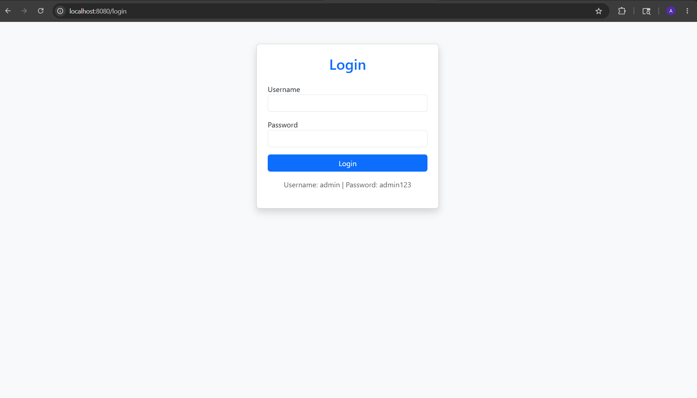
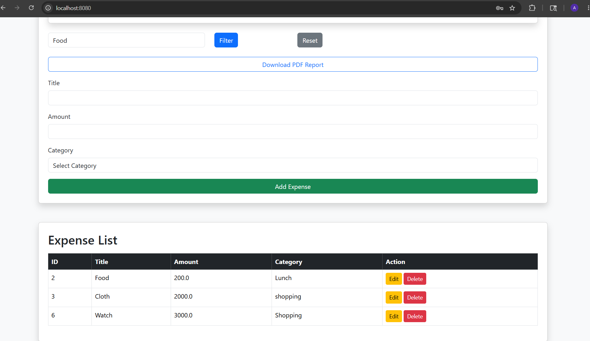
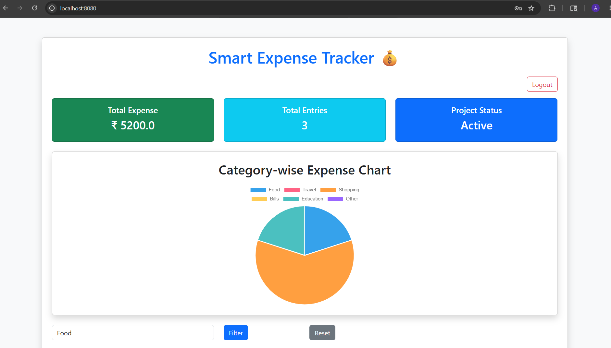

# Smart Expense Tracker 💰

A full-stack Expense Management System built using Spring Boot, Thymeleaf, MySQL, and Bootstrap.

---

## 🚀 Features

- User Login Authentication
- Add Expenses
- View Expenses
- Edit Expenses
- Delete Expenses
- Category Filtering
- Dashboard Analytics
- Expense Pie Chart
- PDF Report Download
- Responsive Bootstrap UI

---

## 🛠️ Technologies Used

- Java
- Spring Boot
- Thymeleaf
- MySQL
- Bootstrap
- Maven
- Chart.js

---

## 📸 Screenshots

### Login Page

### Dashboard

### Analytics Chart

## ▶️ How To Run

1. Clone repository
2. Open project in Eclipse
3. Configure MySQL database
4. Run Spring Boot application
5. Open:

Run locally using:
http://localhost:8080/login

---

## 🔐 Login Credentials

Username: admin  
Password: admin123

---

## 👨‍💻 Developer

Akash Harawal
